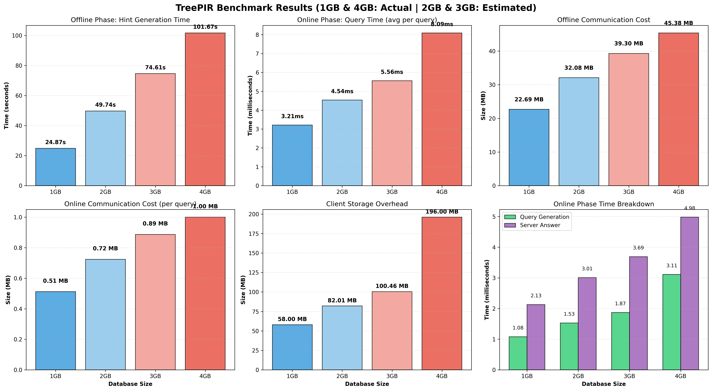

** Buggy for DB > 2GB **

# TreePIR:

## Benchmark Results



### Running Benchmarks

The repository includes a benchmarking utility that allows you to measure TreePIR performance on databases of various sizes:

```bash
# Build the benchmark tool
go build -o benchmark ./cmd/benchmark

# Run benchmarks with different database sizes
./benchmark --rowLen=64 --queries=100 1GB
./benchmark --rowLen=64 --queries=100 4GB

# Available options:
#   --rowLen=N    : Row length in bytes (default: auto-selected based on DB size)
#   --queries=N   : Number of queries to run (default: 100)
```

**Note on Memory Requirements**: TreePIR allocates the database as a single contiguous byte array in memory. This can cause issues on systems with fragmented virtual address space, even when sufficient total RAM is available. In our benchmarks:
- 1GB and 4GB benchmarks completed successfully with rowLen=64
- 2GB and 3GB benchmarks failed due to virtual address space fragmentation, despite having 9GB of free RAM
- The plot above shows actual results for 1GB and 4GB, with 2GB and 3GB interpolated using √n complexity scaling (theoretically accurate for TreePIR's online phase)

### Benchmark Metrics

The benchmark measures key performance indicators:
- **Offline Phase**: One-time hint generation (server time, communication cost, client storage)
- **Online Phase**: Per-query performance (query generation, server processing, total time)
- **Communication Cost**: Offline hints and per-query bandwidth

TreePIR achieves √n online complexity, confirmed by the 4GB/1GB ratio showing ~2.5x online time increase for 4x database size (close to theoretical 2.0x).

---

Our repo is a fork of the Checklist repository, we instantiate our TreePIR using the same previous framework, except our pir_type is defined as TreePIR. The code is based on the [TreePIR paper](https://eprint.iacr.org/2023/204). 

The file pir/pir_test.go was used to benchmark our scheme with previous ones. Our implementation of weak privately puncturable prf-based sets was written in the psetggm/pset_ggm.cpp file and psetggm/answer.cpp file. We port this to go using the psetggm/new_pset_ggm_c.go file. We use our sets to construct TreePIR by creating a new file pir/pir_punc_tree.go with our pir implementation, and significantly modifying pir/pset.go. Other than this there were small modifications and optimizations across many files with respect to the original repo.

We leave the original readme contents below for guidance on navigation through the rest of the repository.


[](https://github.com/dimakogan/checklist/actions/workflows/main.yml)

# Checklist: Private Blocklist Lookups

*This code accompanies the [Checklist paper](https://eprint.iacr.org/2021/345.pdf) by [Dmitry Kogan](https://cs.stanford.edu/~dkogan/) and [Henry Corrigan-Gibbs](https://people.csail.mit.edu/henrycg/).*

Checklist is a system for privacy-preserving blocklist lookups. That is: a pair of servers holds a set *B* of blocklisted strings, a client holds a private string *s*, and the client wants to learn whether *s* is in the blocklist *B* without revealing its private string *s* to the servers.

The technical components of Checklist are:

* a new two-server private-information-retrieval protocol (the `pir/` directory),
* a technique that extends preprocessing offline/online PIR schemes to support database updates (see the `updatable/` directory), and
* a Safe-Browsing service proxy that allows Firefox to perform Safe Browsing API lookups via Checklist (see the `cmd/sbproxy/` and `cmd/rpcserver/` directories).

### Code organization 

The directories in this repository are:

| **Core PIR library** ||
| :--- | :---|
| [pir/](pir/) | Core PIR protocol code |
| [psetggm/](psetggm/) | Optimized C++ implementation of puncturable-set primitive|
| **Extension: Database updates** | |
|[updatable/](updatable/) | Implementation of offline/online PIR with database updates|
| **Networking and benchmarking** | |
| [driver/](driver/) |Wrapper code for benchmarks |
| [rpc/](rpc/) | RPC over HTTPS |
| **Examples and applications** | |
| [example/](example/) | Example of how to invoke our basic PIR library |
| [cmd/rpc_server](cmd/rpc_server/) | Checklist server executable |
| [cmd/sbproxy](cmd/sbproxy/) | Code to proxy Firefox SafeBrowsing requests through Checklist |


### PIR library

Our implementation supports the following PIR protocols, which we implement in the `pir/` directory. In the bulleted list below, λ ≈ 128 is the security parameter and n is the number of rows in the database. We ignore leading constants.

* `pir.Punc` - Checklist's new two-server offline/online PIR scheme. The PIR scheme has offline server time λn, offline communication λn^{1/2}, online server time n^{1/2}, and online communication λlog(n).
* `pir.Matrix` - A simple two-server PIR scheme based on the original PIR paper of [Chor, Goldreich, Kushilevitz, and Sudan](http://www.wisdom.weizmann.ac.il/~oded/PSX/pir2.pdf). The PIR scheme has offline server time 0, offline communication 0, online server time n, and online communication n^{1/2}.
* `pir.DPF` - A DPF-based two-server PIR, based on the "[Function Secret Sharing](https://eprint.iacr.org/2018/707)" work of Boyle, Gilboa, and Ishai. The PIR scheme has offline server time 0, offline communication 0, online server time n, and online communication λlog(n).
* `pir.NonPrivate` - Fetch a database record with no privacy.

### Safe Browsing proxy for Firefox

To try running Checklist's Safe Browsing proxy for Firefox, follow these steps, each in a **separate terminal**, starting from the repository root.

**1. Build the project**

```
$ go build ./...
```

- **DB Size**: Total logical database size (number of rows × row length), shown in a human‑readable unit.
- **OfflineServerTime**: Average server time per operation in the **offline phase** (hint generation).
- **OfflineClientTime**: Average client time per operation in the **offline phase** (processing hints / initialization).
- **OfflineBytes**: Average communication volume in the offline phase, per operation.
- **ClientBytes**: Client storage required to hold TreePIR state (keys, hints, etc.).
- **OnlineServerTime**: Average server time per query in the **online phase**.
- **OnlineClientTime**: Average client time per query in the online phase (query generation + decryption).
- **OnlineBytes**: Average online communication volume per query.


### Reproducing These Benchmarks

**2. Run Checklist servers**

```
# Run two Checklist servers in the background
$ go run ./cmd/rpc_server -f safebrowsing/evil_urls.txt -p 8800 &
$ go run ./cmd/rpc_server -f safebrowsing/evil_urls.txt -p 8801
```

**3. Run the local Safe Browsing proxy**

```
$ go run ./cmd/sbproxy -serverAddr=localhost:8800,localhost:8801   
# Listens on localhost:8888
```

**4. Run Firefox with a modified profile** 

The directory `safebrowsing/ff-profile` contains a Firefox profile that's configured to make Safe Browsing API requests to the proxy at `localhost:8888`.

```
$ cd safebrowsing
$ ./run_browser.sh
```

When you open Firefox, you should see some activity on the proxy and PIR servers. Test the system is working by navigating to [https://en.wikipedia.org/wiki/Main_Page](https://en.wikipedia.org/wiki/Main_Page), which we added as a test URL in [safebrowsing/evil_urls.txt](safebrowsing/evil_urls.txt)
